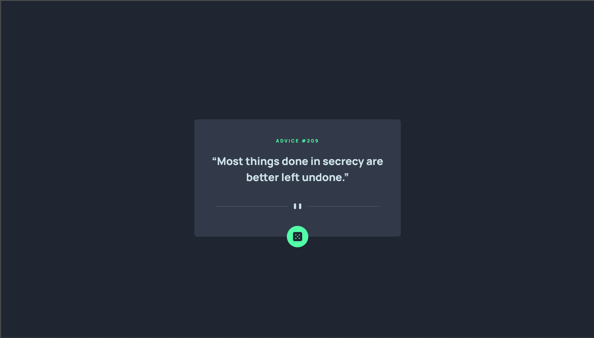
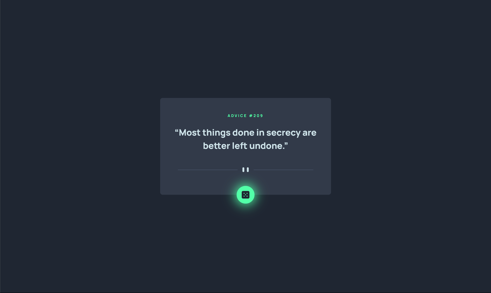
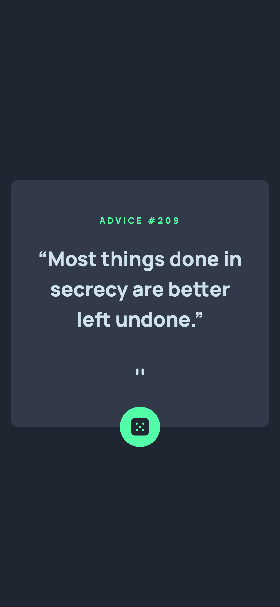

# Frontend Mentor - Advice generator app solution

This is a solution to the [Advice generator app challenge on Frontend Mentor](https://www.frontendmentor.io/challenges/advice-generator-app-QdUG-13db). Frontend Mentor challenges help you improve your coding skills by building realistic projects.

## Table of contents

- [Overview](#overview)
  - [The challenge](#the-challenge)
  - [Screenshots](#screenshots)
  - [Links](#links)
- [My process](#my-process)
  - [Built with](#built-with)
  - [What I learned](#what-i-learned)
  - [Useful resources](#useful-resources)
- [Author](#author)

## Overview

### The challenge

Users should be able to:

- View the optimal layout for the app depending on their device's screen size
- See hover states for all interactive elements on the page
- Generate a new piece of advice by clicking the dice icon

### Screenshots

</img>

</img>

</img>

### Links

- Solution URL: [Github Code](https://github.com/smgsankar/frontend-mentor-challenges/tree/master/challenges/advice-generator-app)
- Live Site URL: [Advice Generator App](https://advice-generator-fe.web.app/)

## My process

### Built with

- Typescript
- JSX
- Flexbox
- [React](https://reactjs.org/) - JS library
- [Tailwind CSS](https://tailwindcss.com/) - For styles

### What I learned

- Adding shadows and other custom css styles and rules using Tailwind CSS

### Useful resources

- [Glow Effect using CSS Box Shadow property](https://codersblock.com/blog/creating-glow-effects-with-css/)
- [Shadows Tailwind CSS Docs](https://tailwindcss.com/docs/box-shadow)

## Author

- Website - [Not yet]()
- Frontend Mentor - [@smgsankar](https://www.frontendmentor.io/profile/smgsankar)
- LinkedIn - [@smgsankar](https://www.linkedin.com/in/smgsankar)
- Github - [@smgsankar](https://www.github.com/smgsankar)
