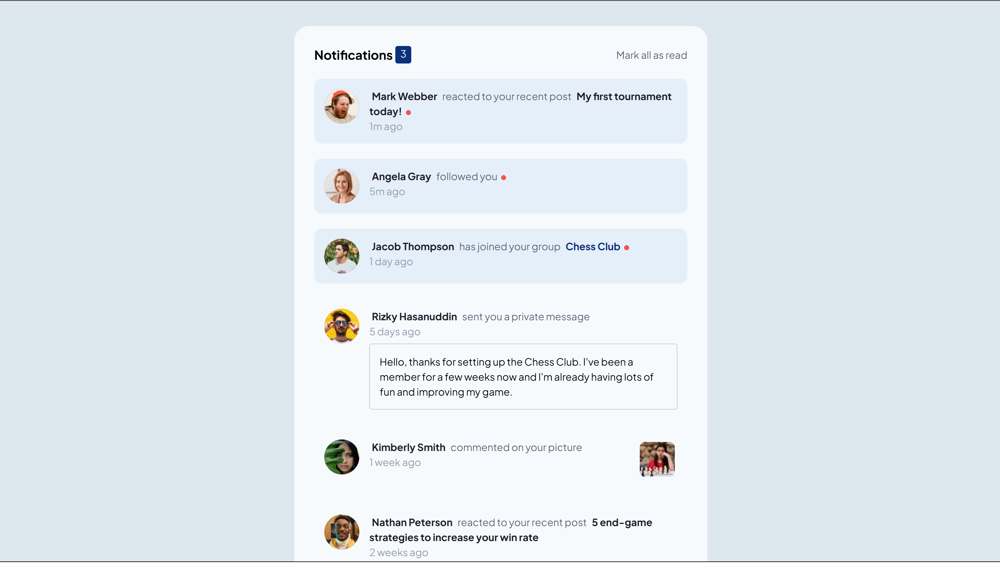
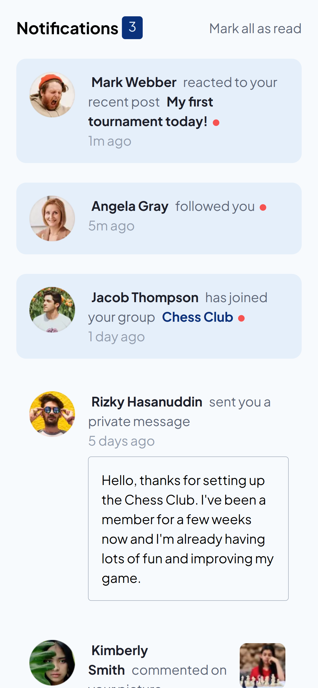

# Frontend Mentor - Notifications page solution

This is a solution to the [Notifications page challenge on Frontend Mentor](https://www.frontendmentor.io/challenges/notifications-page-DqK5QAmKbC). Frontend Mentor challenges help you improve your coding skills by building realistic projects.

## Table of contents

- [Overview](#overview)
  - [The challenge](#the-challenge)
  - [Screenshot](#screenshot)
  - [Links](#links)
- [My process](#my-process)
  - [Built with](#built-with)
  - [What I learned](#what-i-learned)
- [Author](#author)

## Overview

### The challenge

Users should be able to:

- Distinguish between "unread" and "read" notifications
- Select "Mark all as read" to toggle the visual state of the unread notifications and set the number of unread messages to zero
- View the optimal layout for the interface depending on their device's screen size
- See hover and focus states for all interactive elements on the page

### Screenshot

</img>

</img>

### Links

- Solution URL: [Github Code](https://github.com/smgsankar/frontend-mentor-challenges/tree/master/challenges/notifications-page)
- Live Site URL: [Notifications Page](https://notifications-page-fe.web.app/)

## My process

- Brushed up more Tailwind CSS and Flexbox concepts along with some web development fundamentals

### Built with

- Typescript
- JSX
- Flexbox
- [React](https://reactjs.org/) - JS library
- [Tailwind CSS](https://tailwindcss.com/) - For styles

### What I learned

## Author

- Website - [Not yet]()
- Frontend Mentor - [@smgsankar](https://www.frontendmentor.io/profile/smgsankar)
- LinkedIn - [@smgsankar](https://www.linkedin.com/in/smgsankar)
- Github - [@smgsankar](https://www.github.com/smgsankar)
