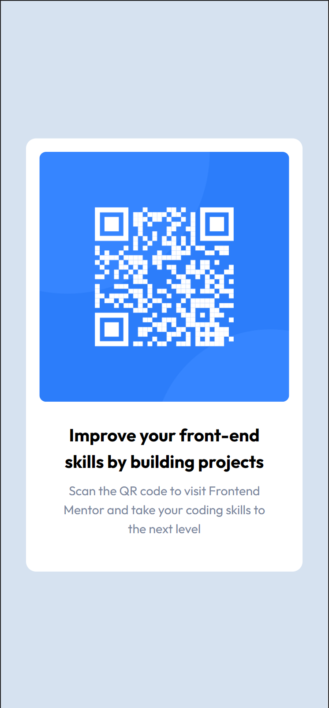

# Frontend Mentor - QR code component solution

This is a solution to the [QR code component challenge on Frontend Mentor](https://www.frontendmentor.io/challenges/qr-code-component-iux_sIO_H). Frontend Mentor challenges help you improve your coding skills by building realistic projects. 

## Table of contents

- [Overview](#overview)
  - [Screenshot](#screenshot)
  - [Links](#links)
- [My process](#my-process)
  - [Built with](#built-with)
  - [What I learned](#what-i-learned)
  - [Useful resources](#useful-resources)
- [Author](#author)

## Overview

### Screenshot

### Links

- Solution URL: [To be added]()
- Live Site URL: [To be added]()

## My process

### Built with

- Typescript
- JSX
- Flexbox
- [React](https://reactjs.org/) - JS library
- [Tailwind CSS](https://tailwindcss.com/) - For styles

### What I learned

This is my first experience using Tailwind CSS and it is a good start for me personally. And these are the things I got to know working on this challenge:

- Basic Usage of Tailwind CSS for CSS styles like margin, padding, font, borders and so on
- Adding custom fonts and colors by extending them with default ones from tailwind config

### Useful resources

- [Hatchet](https://hatchet.com.au/blog/how-to-use-google-fonts-in-tailwind-css/#:~:text=Steps%20for%20Google%20Font%20in%20Tailwind%201%20Step,Step%203%3A%20Configure%20Google%20Font%20in%20Tailwind%20CSS) - This helped me add custom fonts from Google Fonts to React Tailwind Project

## Author

- Website - [Not yet]()
- Frontend Mentor - [@smgsankar](https://www.frontendmentor.io/profile/smgsankar)
- LinkedIn - [@smgsankar](https://www.linkedin.com/in/smgsankar)
